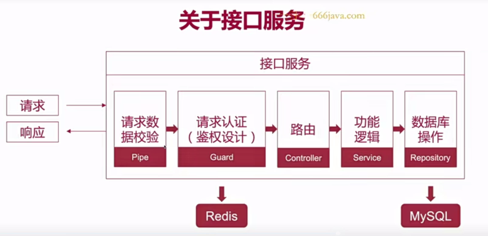
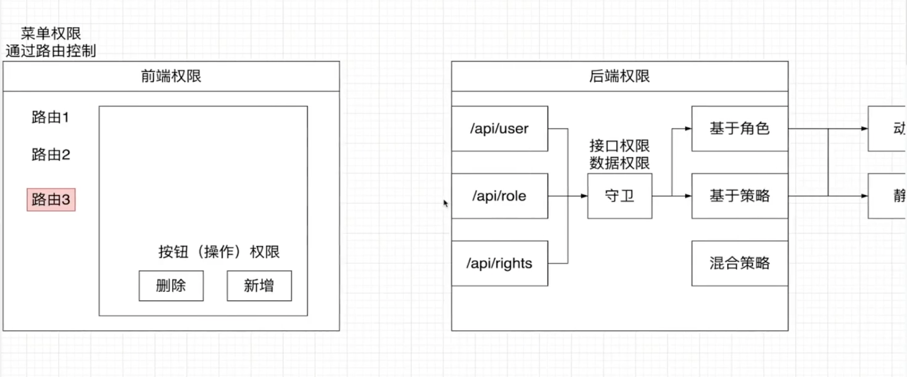
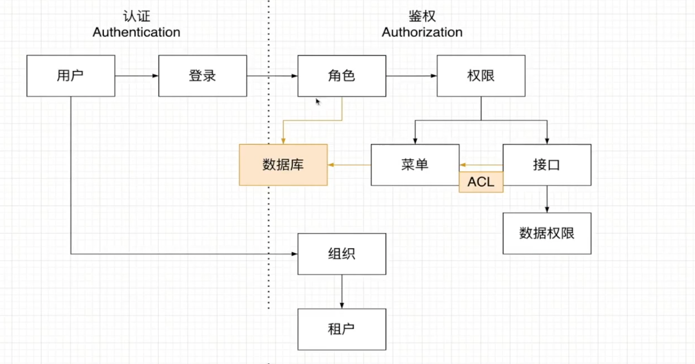
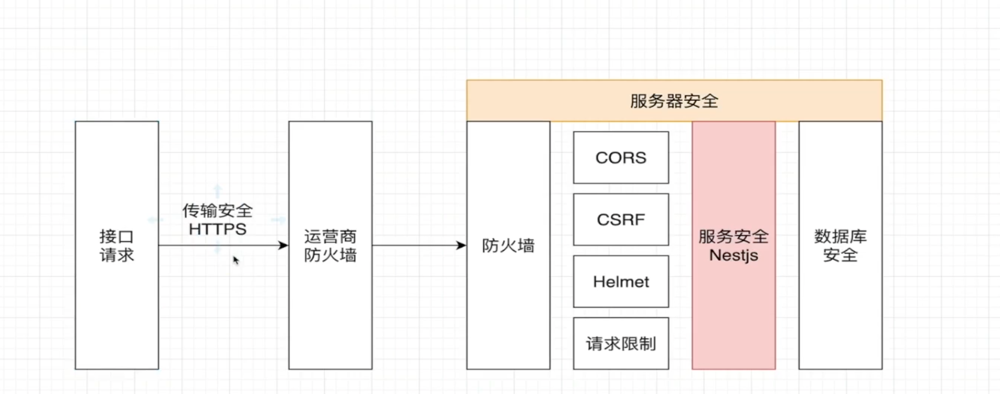
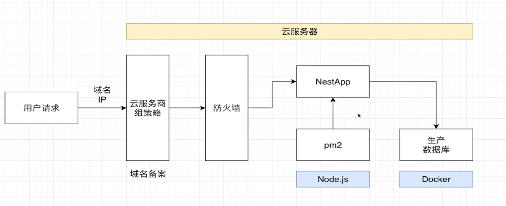
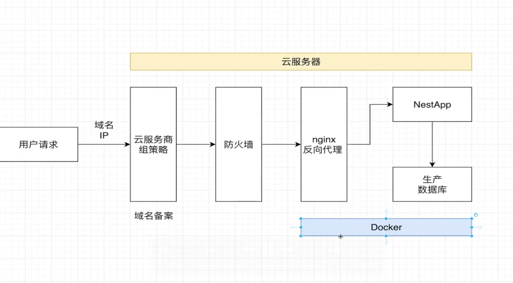

# g-nest-app

nest 框架的后端模板

<p align="center">
  <a href="http://nestjs.com/" target="blank"></a>
</p>

## 安装

```bash
pnpm install
```

## 运行

```bash
# development
$ pnpm run start

# watch mode
$ pnpm run start:dev

# production mode
$ pnpm run start:prod

# 测试

```bash
# unit tests
$ pnpm run test

# e2e tests
$ pnpm run test:e2e

# test coverage
$ pnpm run test:cov
```

## docker

```bash
# 运行Docker容器，-d参数表示在后台运行容器，不显示容器的输出
$ docker-compose up -d

# 停止Docker Compose项目
$ docker-compose down

# 删除Docker容器
$ docker-compose rm -f

# 查看容器
$ docker ps

```

## License

Nest is [MIT licensed](LICENSE).

## 参考资料

### 生命周期


### 接口服务



### 核心概念


### 数据库联合查询对比


### 关于方法的全名


### 服务与存储库的区别


### TypeOrm 方法对比


### 管道的应用


### 管道的类型


### 创建管道的过程


### JWT


### JwtStrategy


### signup 流程


### 守卫和拦截器区别


### 序列化流程


### 前后端权限控制



### 权限系统的设计以及主流的五种权限模型

- [权限系统的设计以及主流的五种权限模型](https://www.cnblogs.com/tkuang/p/16717131.html)
- [超全面的权限系统设计方案](https://blog.csdn.net/z_ssyy/article/details/130256410)

### 认证和鉴权



### 服务器安全



### 服务器部署环境 PM2



### 服务器部署环境 Docker


